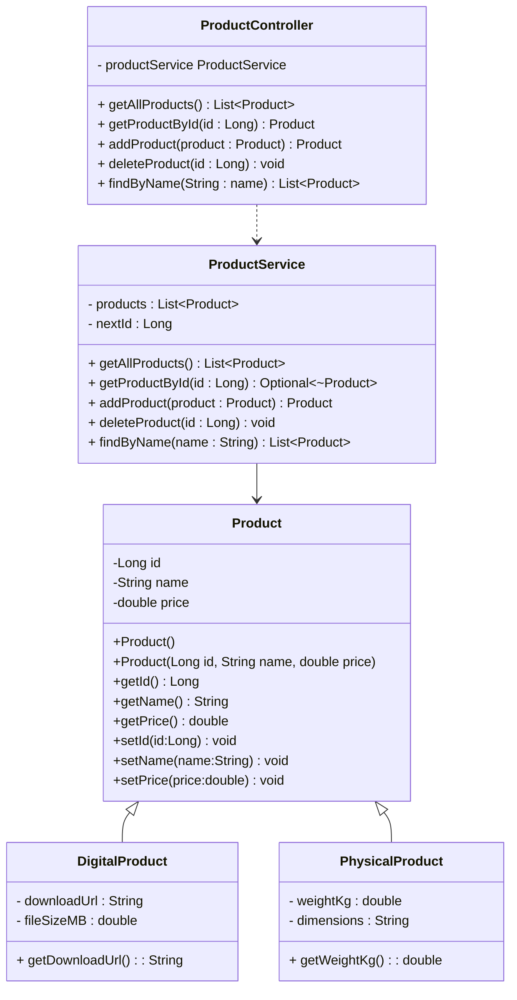

```mermaid
classDiagram
  class Product {
    -Long id
    -String name
    -double price
    +Product()
    +Product(Long id, String name, double price)
    +getId() Long
    +getName() String
    +getPrice() double
    +setId(id:Long)void
    +setName(name:String)void
    +setPrice(price:double)void
  }
    class ProductService {
        - products : List~Product~
        - nextId : Long
        + getAllProducts()  List~Product~
        + getProductById(id : Long)  Optional~~Product~
        + addProduct(product : Product)  Product
        + deleteProduct(id : Long)  void
        + findByName(name : String)  List~Product~
    }
    class ProductController {
        - productService  ProductService
        + getAllProducts()  List~Product~
        + getProductById(id : Long)  Product
        + addProduct(product : Product)  Product
        + deleteProduct(id : Long)  void
        + findByName (String : name) List~Product~
    }
    ProductController ..> ProductService
    ProductService --> Product
    class DigitalProduct {
        - downloadUrl : String
        - fileSizeMB : double
        + getDownloadUrl() : String
    }
    class PhysicalProduct {
        - weightKg : double
        - dimensions : String
        + getWeightKg() : double
    }
    Product <|-- DigitalProduct
    Product <|-- PhysicalProduct


```